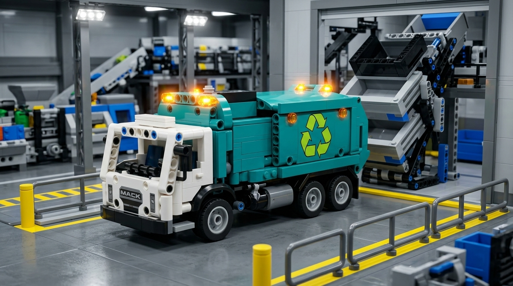
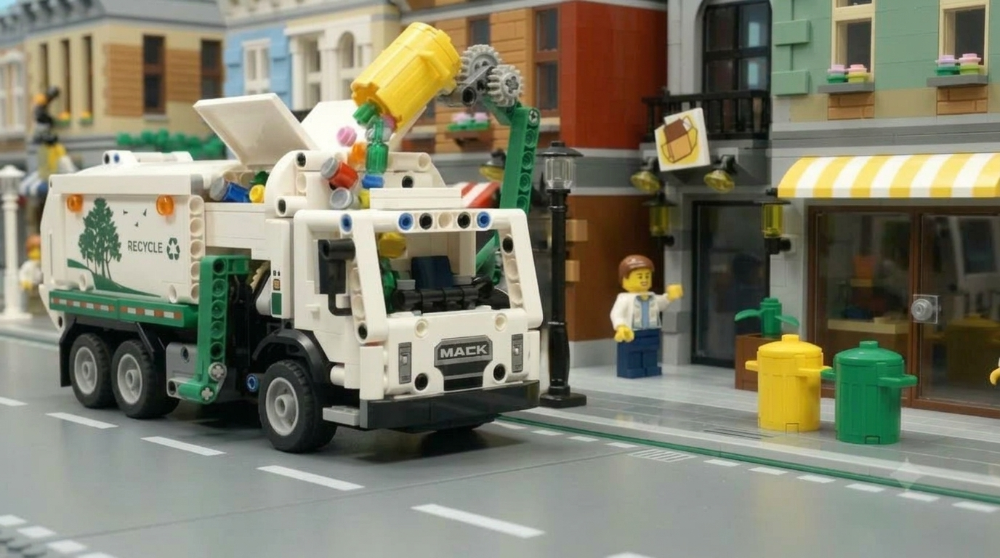

# 🚛⚡ Эко-Мусоровоз Mack LR Electric — Городской Рейс

[](https://threejs.org/)
[](https://developer.mozilla.org/ru/docs/Web/JavaScript)
[](https://developer.mozilla.org/ru/docs/Web/HTML)
[](https://developer.mozilla.org/ru/docs/Web/CSS)
[](LICENSE)
[](https://github.com/dzuyonak/recycle-truck-simulator)

🎮 **[Играть онлайн (Live Demo)](https://dzuyonak.github.io/recycle-truck-simulator/)**

Браузерная 3D-игра в ярком стиле **LEGO**, в которой вы управляете современным электрическим мусоровозом **Mack LR Electric**. Собирайте контейнеры с раздельным мусором на улицах города, прессуйте вторсырье и доставляйте его на завод по переработке!

> ⚡ **Vibecoding Experiment**: проект полностью разработан методом вайбкодинга с помощью AI в среде Cursor — от математики физики подвески и логистики смены до процедурного Web Audio и рендеринга Three.js.

---

## 📸 Галерея

| Разгрузка на заводе переработки | Забор контейнера с улицы |
| :---: | :---: |
|  |  |

---

## ✨ Ключевые особенности

### 🚚 Физика и модель мусоровоза
* **Детальная 3D-модель Mack LR Electric**: реалистичная кабина, воздухозаборник, аккумуляторные батареи, шевронный бампер, ступеньки для рабочих и номерной знак `[⚡ MACK-EV 26]`.
* **Реалистичная физика тяжелого коммерческого транспорта**: плавная инерция, аутентичный радиус разворота, крен кузова в поворотах и клевки подвески при торможении/разгоне.
* **Расчёт физической массы груза**: до **1440 кг** полезной нагрузки (12 контейнеров × 120 кг). Набранный вес напрямую влияет на инерцию, ускорение, тормозной путь, управляемость и крен — полностью загруженная машина теряет до **35 % разгона**, **20 % торможения** и **18 % отзывчивости руля**.
* **Реалистичная система питания EV**:
  * Динамический разряд тяговой батареи — **100 % → 15 % ровно за ~1.5 минуты** агрессивной езды (при 60 FPS), с ростом расхода до **+45 %** под полной загрузкой.
  * Расход энергии на гидравлику **e-PTO**: **−3 %** заряда за каждый забранный бак с пиковой мощностью до **240 kW** на шкале энергопотока.
  * **Рекуперация** при торможении и накате (возврат энергии до **−95 kW**), холостой ход потребляет ~2 kW.
* **Внутренний уплотнитель (Compactor)**: прессующая плита автоматически трамбует мусор после каждого забора.

### 🏙️ Логистика и городская среда
* **Процедурный спавн контейнеров**: **12 баков** выбираются случайно из расширенного пула на **44 точки** вдоль бордюров дорог (Fisher-Yates, без повторов) со строгим балансом категорий — **4 пластика 🟡, 4 бумаги 🔵, 4 стекла 🟢**. Все точки спавна лежат строго в безопасном внутреннем периметре (`|along| ≤ 100 м`, `SPAWN_LIMIT = 100`) и внутри асфальтированной сетки `|x|, |z| ≤ 128` — баки физически не могут появиться за пределами города, в заборах или в декорациях внешнего пояса, а манипулятор всегда достаёт до них с полосы движения.
* **Живой процедурный город**: двухэтажные модульные виллы с панорамными витринами и солнечными панелями, бирюзовые велодорожки, пешеходные зебры, стоп-линии, городской парк с деревьями и лавочками.
* **Трафик NPC**: 8–10 низкополигональных легковых машин курсируют по полосам, тормозят перед грузовиком, уступают на перекрёстках и застревают в пробках. Маршруты и зоны разворота **строго ограничены внутренними перекрёстками** (`NPC_TURN_ZONE = 122`), поэтому машины физически не могут выехать за пределы асфальтированных дорог — ни в тупики, ни в фоновые декорации. Столкновение начисляет **+5 секунд** штрафа ко времени смены.
* **Внешний фоновый пояс (Perimeter Backdrop)**: за пределами крайних дорог процедурно достраивается целый пояс города — промышленные ангары, склады с разноцветными LEGO-контейнерами, цистерны-силосы, ряды таунхаусов и лесопарк со **100+ деревьями** (только в западном массиве их 105). Пояс стартует прямо от кромки дороги и полностью убирает эффект «висящей в воздухе плиты» — горизонт читается как сплошная застройка, а не обрыв асфальта в зелёное поле.
* **Геометрия дорожной сети**: дорожное полотно аккуратно обрезано в границах рабочей зоны (**±128 м**, сразу за крайними перекрёстками ±120) — за тротуаром больше нет лишней асфальтовой полосы. На каждом выезде стоит тупик: бетонные отбойники и знак «Тупик» (за кромкой, на тротуаре периметра), исключающий сквозной проезд трафика в фоновые декорации.
* **Строгое зонирование тротуаров**: вся уличная мебель (скамейки, гидранты, фонари, дорожные знаки, урны-ориентиры) вынесена строго на приподнятый тротуар внутрь кварталов (`EDGE_IN = 2.2` м при ширине тротуара 3.4 м). Проезжая часть полностью очищена — **0 коллайдеров и 0 препятствий на дорогах**.
* **Открытая зарядная станция (Charging Pad)** на заводе: светящаяся разметка, неоновая индикация зарядки и метка «⚡» на миникарте. Заряжает прямо во время смены (полный цикл 0 → 100 % за ~21 с).
* **Механика промежуточного сброса (Pit-stop Dump)**: заезд в шлюз завода в середине смены позволяет разгрузить физический вес кузова, вернув машине лёгкость и экономию батареи, **не сбрасывая общий прогресс рейса** (короткая блокировка управления на 1.8 с, анимация заднего борта и вылет вторсырья).
* **Служба эвакуации при 0 % заряда**: грузовик буксируется на завод, заряд восстанавливается до 35 %, а ко времени смены добавляется **+30 секунд** штрафа.

### 🎬 Кинематографичные ролики (Cutscenes)
* **Забор мусора**: 6-фазный стоп-моушн ролик (захват бака, подъем манипулятором, опрокидывание в люк, прессование, возврат на тротуар) со звуками пневматики и тряской камеры.
* **Выгрузка на заводе**: 5-фазный ролик разгрузки в шлюзе завода с подъемом заднего борта, анимированным водопадом разноцветного LEGO-вторсырья, лазерным сканированием и учетом сэкономленного CO₂.
* Возможность мгновенного пропуска любой анимации клавишей `ПРОБЕЛ`, кликом или кнопкой на экране.

### 🎥 4 режима камеры (`C`)
1. **3/4 Heroic Chase**: динамический полубоковой ракурс от третьего лица с плавным доворотом в сторону движения.
2. **Bird's-Eye**: классический изометрический вид сверху под углом 45° в духе градостроительных симуляторов.
3. **Вид с капота / от первого лица**: яркий дневной вид прямо перед лобовым стеклом.
4. **Вид из кабины (Cockpit / First-Person)**: полноценное место водителя слева, вращающийся синхронно с колёсами руль, приборная панель со спидометром, микроподвеска с креном в поворотах и клевками при торможении.

### 🖥️ Интерфейс и HUD
* **Двухстрочный монитор статуса** с независимыми шкалами:
  * **Строка 1 — общий прогресс смены**: «Собрано баков: X / 12».
  * **Строка 2 — текущее наполнение кузова**: «В кузове: Z (W кг)» (падает в ноль после каждого сброса, в т.ч. промежуточного).
* **EV-приборная панель**: спидометр, заряд батареи, живой энергопоток (kW), селектор передач, статус зарядки и масса груза.
* **Система оповещений о критически низком заряде** (≤ 15 %): пульсирующая красная индикация батареи и двойной звуковой сигнал (с гистерезисом до 18 %, чтобы избежать дребезга).
* **Панель рекордов и карьеры**: личное лучшее время рейса, всего переработано кг, количество смен и разбивка по категориям (сохраняется локально в браузере).

### 📱 Поддержка планшетов и смартфонов
* Полноценное сенсорное управление: рулевой блок под левую руку, педали и кнопки действий под правую руку.
* Автоматическая адаптация под альбомную и портретную ориентацию экрана.

### 🔊 Синтезированный процедурный звук (Web Audio API)
* Генерация звуков на чистом Web Audio без внешних тяжелых аудиофайлов.
* Динамический звук электромотора Mack EV (зависит от скорости и реверса), шипение пневмотормозов, сервоприводы гидравлики, грохот сброса мусора, пневматический клаксон и победный джингл.

### ⚡ Высокая производительность (60 FPS)
* **Инстансинг и статичная геометрия**: фоновые деревья, LEGO-контейнеры и декорации внешнего пояса рисуются через `THREE.InstancedMesh` (сотни объектов — за 1 draw call), а для всей статичной застройки города отключено автообновление матриц (`matrixAutoUpdate = false`), что снимает нагрузку с CPU каждый кадр.
* Оптимизированное количество draw calls (< 400 мешей на всю сцену).
* Карта теней 1024×1024 с компактным фрустумом и мягкой фильтрацией PCFSoft.
* Адаптивный `devicePixelRatio` для экранов Retina / 4K.
* Стабильные **60 FPS и на смартфонах, и на ПК** даже при полной загрузке кузова и максимальном трафике.

---

## 🎮 Управление

### На клавиатуре (ПК / Mac):
| Действие | Клавиши |
| :--- | :--- |
| **Движение вперед (Газ)** | `W` или `Стрелка Вверх` |
| **Тормоз / Задний ход** | `S` или `Стрелка Вниз` |
| **Поворот влево / вправо** | `A` / `D` или `Стрелки Влево` / `Вправо` |
| **Действие с баком / Разгрузка / Промежуточный сброс / Пропуск ролика** | `ПРОБЕЛ` |
| **Смена вида камеры** | `C` |
| **Клаксон (Гудок)** | `H` |
| **Рекорды и статистика** | `L` |
| **Вернуть на дорогу / Перезапуск смены при застревании** | `R` |

### На сенсорном экране (Смартфон / Планшет):
* **Слева**: Рулевые кнопки `◀ ВЛЕВО` и `ВПРАВО ▶`.
* **Справа**: Педали `⚡ ГАЗ` и `🛑 ТОРМОЗ / РЕВЕРС`, интерактивная кнопка действия `🦾 ЗАБРАТЬ` / `📦 РАЗГРУЗИТЬ` / `♻️ ВЫГРУЗИТЬ` / `⏩ ПРОПУСТИТЬ`, гудок `📢` и смена камеры `📷`.

---

## 🚀 Быстрый старт

Проект не требует сборщиков, Node.js или компиляции — он работает прямо в браузере как статический веб-сайт!

### Способ 1. Локальный запуск
Просто откройте файл `index.html` в любом современном браузере:
* Дважды кликните по `index.html`, либо
* Запустите через локальный HTTP-сервер:
```bash
# С помощью Python 3:
python3 -m http.server 8080

# Или с помощью npx serve:
npx serve .
```
Откройте в браузере: `http://localhost:8080`

### Способ 2. Развертывание на GitHub Pages (в 1 клик)
1. Создайте репозиторий на GitHub и загрузите файлы проекта.
2. Перейдите в **Settings** репозитория ➔ вкладка **Pages**.
3. В разделе **Build and deployment** выберите:
   * **Source**: `Deploy from a branch`
   * **Branch**: `main` (или `master`) / folder: `/ (root)`
4. Нажмите **Save**. Через минуту игра станет доступна онлайн:
   👉 **https://dzuyonak.github.io/recycle-truck-simulator/**

---

## 📁 Структура проекта

```text
recycle-truck-simulator/
├── index.html       # Главный HTML-документ, HUD, модальные окна и оверлеи
├── style.css        # Стили интерфейса, glassmorphism, анимации
├── game.js          # Игровой цикл, Three.js 3D-сцена, физика, ролики, логика заданий
├── audio.js         # Синтезатор звуков на базе Web Audio API
├── assets/          # Фотореалистичные кадры кинематографичных роликов
│   ├── pickup.mp4                             # Видеоролик забора мусора (опционально)
│   ├── lego_cutscene_frame1.jpg .. frame6.jpg # Кадры забора контейнера
│   ├── lego_unload_frame1.jpg                 # Шлюз завода переработки
│   └── lego_unload_frame2.jpg                 # Подъем кузова над бункером
├── .gitignore       # Исключения системных и временных файлов
├── LICENSE          # Лицензия MIT
└── README.md        # Документация проекта
```

---

## 🛠️ Стек технологий

* **3D-графика**: [Three.js](https://threejs.org/) (r128) WebGL Renderer, ACESFilmic Tone Mapping, Directional PCF Soft Shadows.
* **Аудио**: Native HTML5 Web Audio API (AudioContext, OscillatorNode, BiquadFilterNode, GainNode).
* **Шрифты**: Google Fonts ([Outfit](https://fonts.google.com/specimen/Outfit), [Rubik](https://fonts.google.com/specimen/Rubik)).
* **Чистый код**: Vanilla JavaScript (ES6+), без тяжелых внешних фреймворков и зависимостей.

---

## 📄 Лицензия

Проект распространяется под свободной лицензией **MIT**. Подробности в файле [LICENSE](LICENSE).

---

### Disclaimer / Legal Notice
This project is an unofficial fan-made interactive simulation created for educational and non-commercial purposes only. 
- LEGO® and the LEGO logo are trademarks of the LEGO Group.
- Mack® and the Mack design are registered trademarks of Mack Trucks, Inc.
This project is not sponsored, endorsed, or affiliated with the LEGO Group, Mack Trucks, Inc., or any of their subsidiaries.
